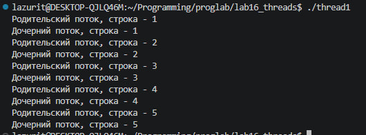
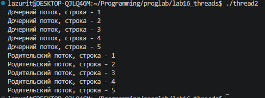
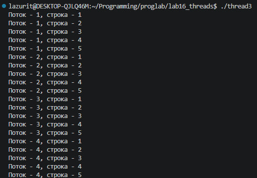
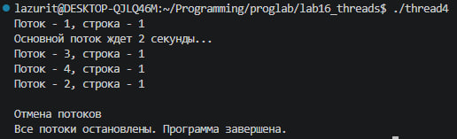
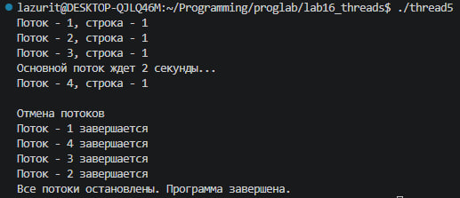

# Лабораторная 16. Знакомство с POSIX потоками

## Задание 1. Создание потока

Параллельная работа потоков потоков с выводом строк

## Задание 2. Ожидание потока

Заставляет родительский поток ждать завершения дочернего с помощью pthread_join(), а значит сначала выводятся строки дочернего потока, потом родительского

## Задание 3. Параметры потока

Создано 4 потока, каждому потоку через 4-й аргумент pthread_create передан указатель на его номер

## Задание 4. Завершение нити без ожидания

Через 2 секунды после запуска все потоки прерываются с помощью pthread_cancel

## Задание 5. Обработать завершение потока

Дочерний поток перед завершение распечатывает сообщение об этом с помощью pthread_cleanup_push

## Задание 6. Реализовать простой Sleepsort

Для каждого элемента массива создается отдельный поток, который засыпает на время значения элемента массива секунд, а после пробуждения выводит число, из-за разного времени сна элементы выводятся в отсортированном виде
