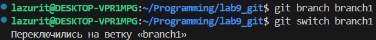
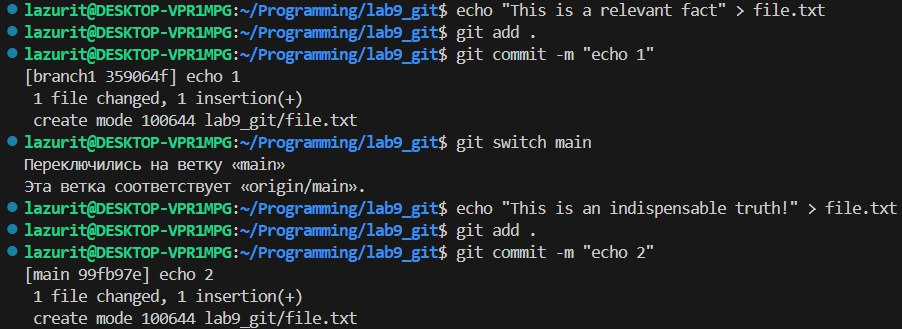
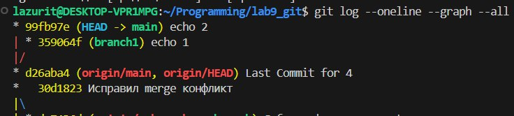
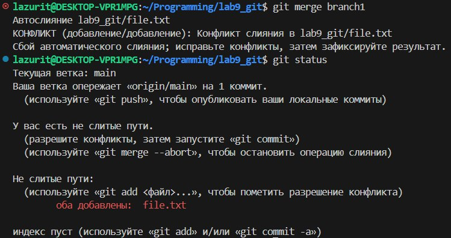
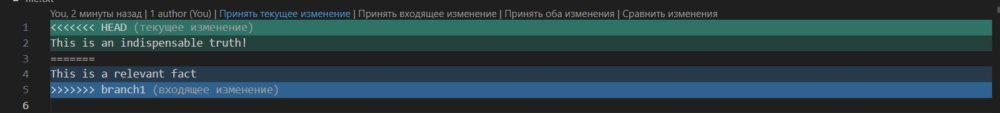
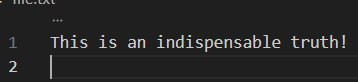
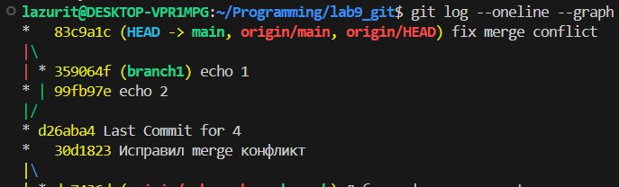
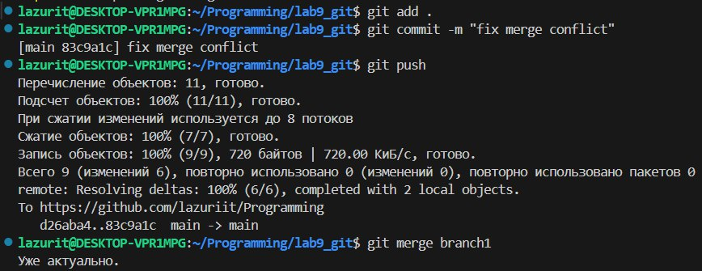

# Оценка 3
### 1.1-17

- git log показывает коммиты создания README.md и lab9_git

- sort.c стал отображаться как неотслеживаемый после добавления

- После добавления файла в stage, git status указывает файлы которые будут добавлены в следующий коммит
- После коммита git status указывает что нечего коммитить

- После добавления коментария git status указал не проиндесированные изменения
- После git add, указывает файлы которые будут добавлены в следующий коммит

- В git status теперь отображаются непроиндесированные изменения и то что ветка main опережает origin/main на 3 коммита

### 2.1-17

- git branch и git status показывют, что мы находимся на новой ветке mybranch

- git log --oneline --graph показывает указание на коммит 

- Файл file2.txt не пропал, а остался в ветке main

- git diff mybranch master показал разницу между двумя ветками, в одной есть файл file1.txt в другой file2.txt, а так же разницу между README.md

# Оценка 4
### 1.1-23

- git diff указывает на добавленные строчки в коде
- git diff --staged пустой т.к. в стедже(git add) ничего нет

- Изменения были проиндексированы(добавленый в стейдж), по этому git diff теперь пуст

- git diff указывает на отличия между проиндексированным и непроиндексированными изменнениями
- git diff --staged указывает на различия между прошлым файлом и проиндесированными изменениями

- В первый раз git status указывает, что есть проиндексированные и не проиндексированные изменения
- После отмены индексации git status указывает, что есть только не проиндексированные изменения

- В журнале отображается только что созданный коммит

- Добавил printf(“hello git\n”);

- git status указывает на не проиндексированные изменения
- git status во 2 раз уже нет указаний, так как мы откатили изменения sort.c

### 2.1-19

- Создан файл greeting.txt c текстом "hello", создана ветка feature/uppercase, git status в feature/uppercase указывает на отсутствие изменений

- git branch указывает на 3 существующие ветки, выделяет ветку в каторой мы находимся

- git log --oneline --graph --all выводит дерево коммитов

- Переместился в ветку main

- cat вывел hello, git diff указывает на то, что в ветке feature/uppercase текст "hello" заменён на "HELLO"
- После слияния веток main и feature/uppercase, cat в ветке main выводит HELLO

- Удаление ветки feature/uppercase, слияние веток main и mybranch

- После слияния git log --oneline --graph --all выводи новое дерево коммитов

# Оценка 5
### 1.1-11

- Создание ветки branch1 и переход на неё

- Перенаправление текстов в file.txt и их коммиты

- git log --oneline --graph --all выводит дерево с новыми коммитами "echo 1", "echo 2"

- Конфлик слияния из за 2 одинаковых файлов с разным текстом в одной и той же строке

-Принял текущие изменения через VS Code тем самым исправил конфликт слияния

- git log --oneline --graph --all выводит дерево с новым коммитом "fix merge conflict"

### 2.1-12
