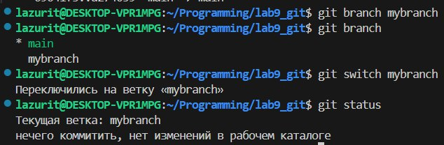
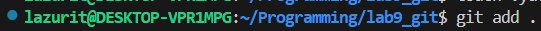
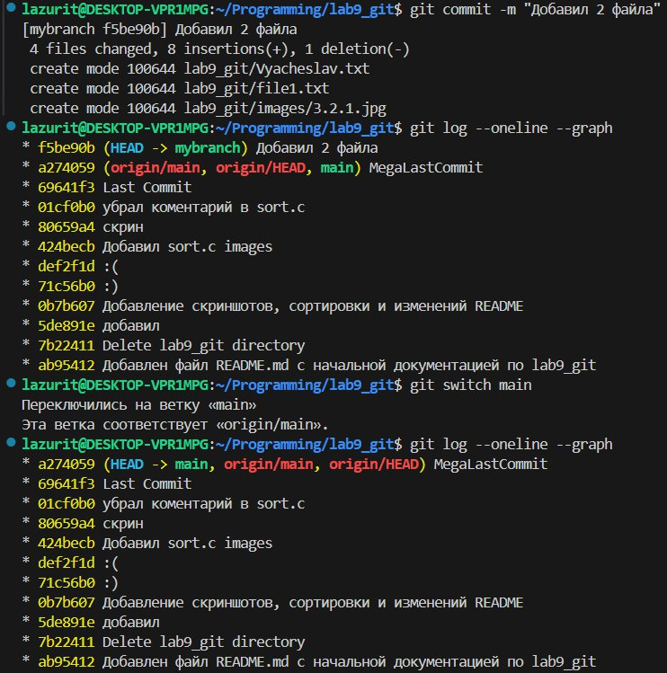

# Оценка 3
### 1.1-17

- Git log показывает коммиты создания README.md и lab9_git

- sort.c стал отображаться как неотслеживаемый после добавления

- После добавления файла в stage, git status указывает файлы которые будут добавлены в следующий коммит
- После коммита git status указывает что нечего коммитить

- После добавления коментария git status указал не проиндесированные изменения
- После git add, указывает файлы которые будут добавлены в следующий коммит

- В git status теперь отображаются непроиндесированные изменения и то что ветка main опережает origin/main на 3 коммита

### 2.1-17

- git branch и git status показывют, что мы находимся на новой ветке mybranch

- git log --oneline --graph показывает указание на коммит сначало mybranch(также показывает что добавлено 2 файла), а потом main

