# Оценка 3
### 1.1-17

- Git log показывает коммиты создания README.md и lab9_git

- sort.c стал отображаться как неотслеживаемый после добавления

- После добавления файла в stage, git status указывает файлы которые будут добавлены в следующий коммит
- После коммита git status указывает что нечего коммитить

- После добавления коментария git status указал не проиндесированные изменения
- После git add, указывает файлы которые будут добавлены в следующий коммит

- В git status теперь отображаются непроиндесированные изменения и то что ветка main опережает origin/main на 3 коммита

### 2.1-17

- git branch и git status показывют, что мы находимся на новой ветке mybranch

- git log --oneline --graph показывает указание на коммит 

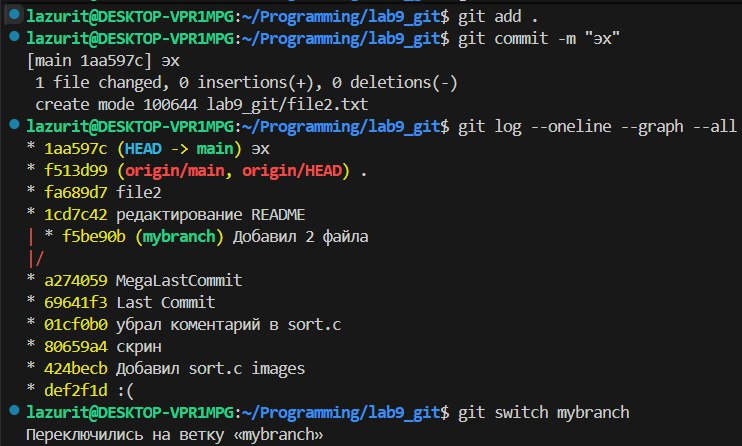
- Файл file2.txt не пропал, а остался в ветке main

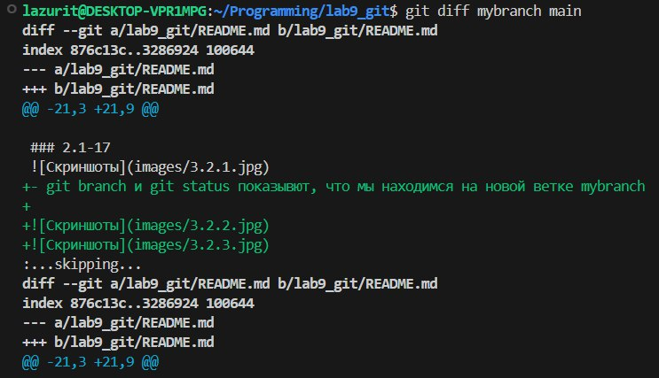
- git diff mybranch master показал разницу между двумя ветками, в одной есть файл file1.txt в другой file2.txt, а так же разницу между README.md

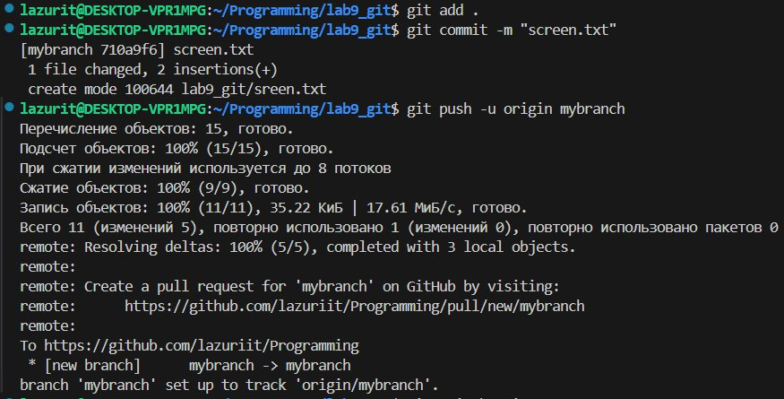

# Оценка 4
### 1.1-23
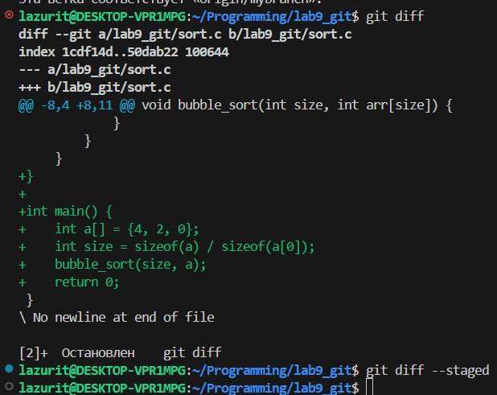
- git diff указывает на добавленные строчки в коде
- git diff --staged пустой т.к. в стедже(git add) ничего нет

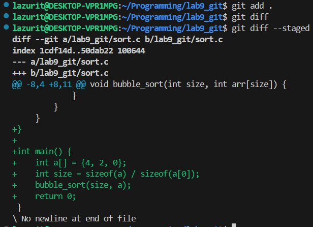
- изменения были проиндексированы(добавленый в стейдж), по этому git diff теперь пуст

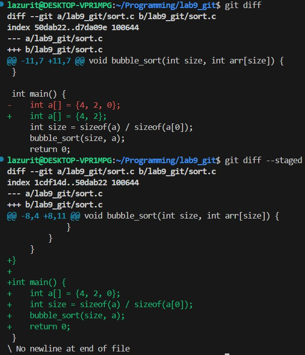
- git diff указывает на отличия между проиндексированным и непроиндексированными изменнениями
- git diff --staged указывает на различия между прошлым файлом и проиндесированными изменениями

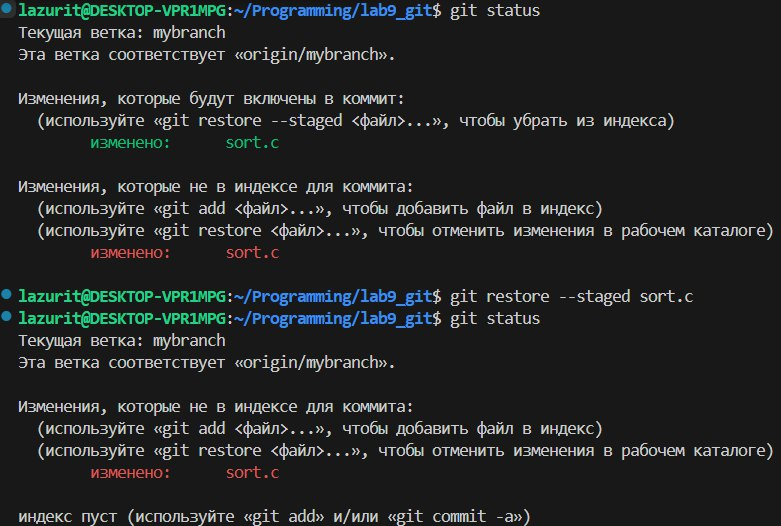
- В первый раз git status указывает, что есть проиндексированные и не проиндексированные изменения
- После отмены индексации git status указывает, что есть только не проиндексированные изменения

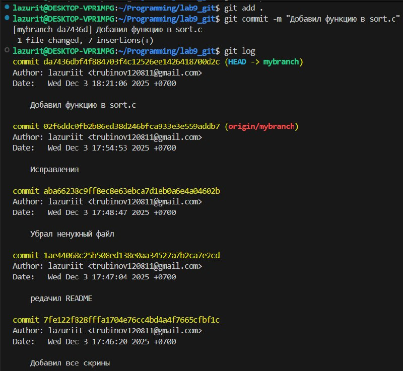
- В журнале отображается только что созданный коммит

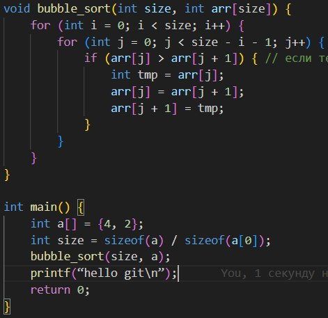
- Добавил printf(“hello git\n”);

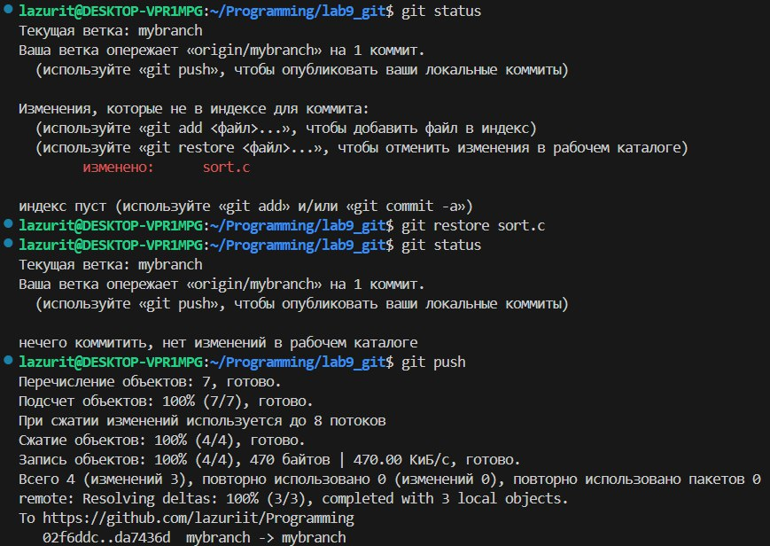
- git status указывает на не проиндексированные изменения
- git status во 2 раз уже нет указаний, так как мы откатили изменения sort.c

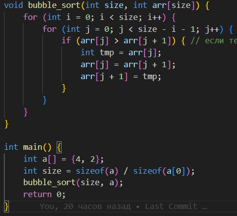
